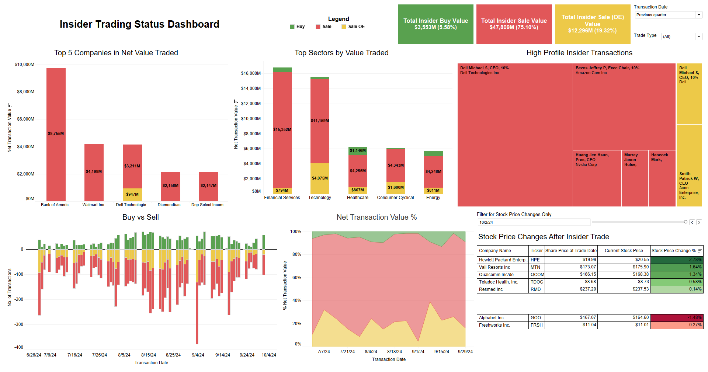

# Insider Trading Dashboard

This is a project aimed at providing investors with an interactive tool to analyze insider transactions. Insider trading activities can serve as significant indicators of stock sentiment, as insider decisions often reflect their confidence in their company's future performance.

The primary goal of this project is to allow investors to make more informed decisions by leveraging insights from insider transactions. The data for the project was sourced by scraping insider transaction listings. This information was then used to create a Tableau dashboard, offering a clear, data-driven overview of insider activities.

The project is divided into two key phases: data acquisition and data visualization. In the first phase, data was collected using web scraping techniques and enriched with financial details. In the second phase, this data was visualized using Tableau to deliver actionable insights for investors.

Insights and recommendations focus on the following key areas:

- Insider Trading Trends: Analysis of buy and sell activities, broken down by industry and company to reveal patterns
- High-Value Trades: Identification of trades by prominent insiders, offering insights into significant investments or divestments
- Sector Comparisons: Comparative analysis across sectors, highlighting which industries are experiencing the most insider trading activity
- Stock Impact: Evaluation of stock price changes in relation to insider buys and sells, revealing how insider sentiment impacts market movement

To see how to reproduce the dashboard and run the code in this project, please follow the [setup](#setup) at the bottom of the readme.

To see the Tableau dashboard, it is linked [here](https://public.tableau.com/app/profile/ian.heung/viz/InsiderDashboard/Dashboard1).

Please look at the individual batch files and scripts to see how the data is scraped, cleaned, and processed for the dashboard.

## Table of Contents
- [Web Scraping](#web-scraping)
- [Data Cleaning and Processing](#data-cleaning-and-processing)
- [Tableau Dashboard](#tableau-dashboard)
- [Insights](#insights)
- [Conclusion](#conclusion)
- [Setup](#setup)
- [Contents and Usage](#contents-and-usage)

## Web Scraping


*Data from OpenInsider.com*

Data for this project was sourced from [openinsider.com](http://openinsider.com), which lists all insider transactions reported under SEC Form 4. Using Python's `requests` package, I scraped key transaction details, including trade date, company tickers, transaction types, and more. In addition to the scraped data, I retrieved daily stock prices and company sector categories via the `yfinance` package, integrating additional financial insights into the dataset.

The scraping process is automated through five Python scripts:
- `save_insider.py`: Scrapes and saves insider transaction data within a specified date range
- `data_processing.py`: Cleans data, retrieves sector info using yfinance, and handles invalid tickers
- `daily_save_insider.py`: Automates daily data extraction for the previous trading day, run via a scheduled `.bat` script for continuous updates
- `ticker_prices`: Retrieves the current stock price and 50-day moving average for unique tickers using yfinance
- `data_functions`: Contains the helper functions for cleaning raw data and retrieving sector categories

## Data Cleaning and Processing

Prior to writing the final Python cleaning script, I performed data exploration and validation to ensure the integrity and accuracy of the dataset.

Key data validation steps included:

- **Handling missing or null values**: Identified and appropriately filled or removed incomplete records
- **Checking for invalid data**: Verified ranges to flag unrealistic values (e.g., negative or zero transactions)
- **Data type verification**: Ensured each column had the correct data type (String, Integer, Float, Datetime)
- **Distribution analysis**: Plotted histograms of numeric fields to spot outliers or incorrect entries
- **String validation**: Removed non-alphanumeric characters from fields like tickers and transaction types
- **Datetime validation**: Flagged any future dates or dates implausibly far in the past

Following this exploration, I developed the aforementioned data cleaning scripts to automate these steps, ensuring the data was clean, consistent, and ready for the Tableau dashboard.

The resulting data comes in two .csv files, `insider_master.csv` and `ticker_price_list.csv`. I used data from 1/1/2014 to 10/12/2024 (the time of publishing this repo), and there are almost 600,000 transactions in `insider_master.csv` and close to 10,000 tickers in `ticker_price_list.csv`.


*Data Structure of the 2 .csv files for Tableau Dashboard*

## Tableau Dashboard
The Tableau Dashboard's role is to highlight key performance indicators (KPIs) that show an overview of the total value of insider transactions. There are interactive charts and tables to help investors key in on specific trends and key companies, such as buy vs sell trends, stock price increases and decreases due to insider activity, and high-value insiders and sectors.



*Tableau Dashboard, link [here](https://public.tableau.com/app/profile/ian.heung/viz/InsiderDashboard/Dashboard1) for interactive version*

The dashboard uses a simple color scheme:
- Buy - Green
- Sell - Red
- Sell Option Exercised - Yellow

Through its intuitive design, the dashboard allows investors to make data-driven decisions based on a variety of insights:

- **Sector and Company Trade Analysis**: The stacked bar charts showing top sectors and companies by net trade value offer a quick snapshot of where insider activity is concentrated. This makes it easier for investors to see which sectors or companies are experiencing heavy insider buy or sell activities. Investors can click on a sector bar to filter and view the data for that specific sector across all other charts in the dashboard.

- **Buy vs Sell Trends:** The bar and area charts provide a visual breakdown of buy vs sell trends over a defined period. Investors can see whether insider transactions are trending towards buying, which may indicate confidence, or selling, which could be interpreted as caution from insiders. These trends can serve as early signals of future stock performance.

- **Executive and Insider Focus:** The treemap visual is particularly useful for identifying key insiders—such as CEOs, CFOs, and board members—whose trades carry weight on the performance of their stocks. By focusing on the highest-value trades from well-known executives, the dashboard reveals where substantial insider sentiment lies, offering investors insights into which companies may be positioned for growth or decline.

- **Stock Price Correlation:** Investors can use the table in the bottom right to assess how insider trades correlate with stock price movements. The ability to track stock price fluctuations alongside insider transactions enables users to observe whether buying activity has historically preceded price increases or whether significant selling has foreshadowed price drops. This correlation between insider actions and market performance allows for strategic investment timing.

For the purposes of this analysis, I will look at the transactions from the previous quarter, as shown by the image.

## Insights
From the initial view of the dashboard, we see that there is an overwhelming proportion of insider selling compared to insider buying. A quick look at the KPIs at the top shows that only 5.58% of net transaction value originated from insider buys, while the rest were from insider selling.

The stacked bar charts show that the top 5 companies in net traded value were all results of insider selling, and if we look at the sector-specific stacked bar chart, it shows all sectors are selling significantly more than buying.

This is further reflected in the Buy vs Sell and Net Transaction Value % plots, where we see the general trend of significantly more insider transactions in volume and value.

There can be several reasons for significantly more insider selling than buying. Insiders may sell shares to take profits, meet personal liquidity needs, or diversify their investments. They might also sell for tax planning purposes or if they anticipate a downturn in the company’s performance.

If we look at sector value traded, we see that healthcare has a significantly larger portion of insider buying compared to other sectors, $1,146M in total insider buying, the highest for all sectors. We can key into the data to see what is happening in the healthcare sector.

We filter the data by trade type so we only get insider buy data. From this, we can see the companies by top net traded value, as well as the top investments by insiders.


*Healthcare Specific Companies and Insiders*

We can see the top 5 companies in net traded value, and some of the high-profile insider transactions in the treemap. To find out more behind the transactions, you can hover over each field and find the ticker associated with the company.


*Peak in Insider Buying in Healthcare*

If we look at the Buy vs Sell chart, we see a gradual rise in the number of transactions in the middle of the quarter, suggesting that there was momentum in the healthcare industry, which peaked in mid-August and gradually decreased. If we look at 9/16/2024, we also see there was a sharp peak in insider buying for the healthcare industry, with 30 total transactions.


*Stock Price Increases and Decreases in the Healthcare Sector*

If we focus on what was happening on that day, we can see the stock prices that increased and decreased as a result of that large volume of transactions.

## Recommendations/Investment Strategies (Healthcare Example)

Here’s how the dashboard can be used to help guide investment decisions in the healthcare sector:

- **Sector Confidence:** The healthcare sector is experiencing more insider buying compared to others, which may indicate higher confidence in this sector's outlook.
- **Cyclical Investment Cycle:** In the current quarter, insider buying in the healthcare sector showed two peaks, both occurring mid-month (August and September). This suggests that insider activity in this sector may follow a cyclical pattern.
- **Stock Price Increases:** Two companies—Mbx Biosciences, Inc, and Zenas Biopharma, Inc—ranked in the top 5 for highest insider traded value this quarter. Since the insider transactions, their stock prices have increased by 47.25% and 11.29%, respectively. This suggests that insider buying might have contributed to positive stock price movements.

This example highlights how the dashboard can help investors gain valuable insights into insider transactions.

## Conclusion

The dashboard is a powerful tool for investors seeking to understand insider trading activity. With various visualizations and filters, users can customize their analysis by sector, date range, or transaction type. 

The automated data pipeline scrapes and processes insider trading data daily, providing up-to-date stock prices and new transactions. This makes it especially useful for gaining real-time insights.

## Setup
Here is the list of required Python packages:

- pandas
- requests
- yfinance

Anaconda
```
conda install pandas requests -c conda-forge yfinance
```

Pip
```
pip install pandas yfinance requests
```

I used Tableau Public since it is free. If you wish to, Tableau Desktop can be used. To download Tableau Public, you will need to fill in your information, then download the application through this [link](https://www.tableau.com/products/public/download).

## Contents and Usage
To get insider data, there are two .bat files to run the scripts. If you are on a Mac/Linux device, a separate version of the .bat files is written in .sh files.

Use a Task Scheduler to run the batch file every day in order to update the data with the previous day's trading data. Here is a [video](https://www.youtube.com/watch?v=EInOL6D5f3Q) on how to use Windows Task Scheduler. Likewise, for Mac, here is a [video](https://www.youtube.com/watch?v=nVlOapHc-kg) on how to use Automator.